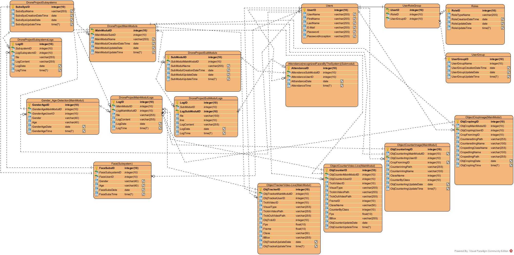
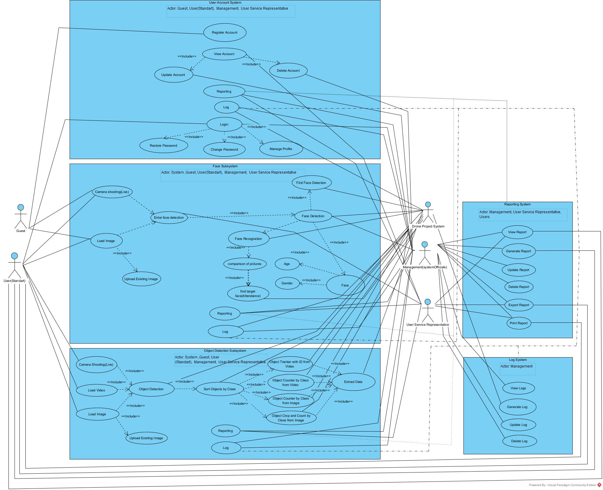

# Developing Autonomous Applications with Drone (Python - OpenCV)

## Full ER Diagram for Drone Project



## Use Case Digram for Drone Project



## Project Overview
This project leverages cutting-edge **image processing** technologies to collect, store, and analyze data from drones, generating insightful reports for diverse applications. Designed for simplicity, mobility, and efficiency, the project integrates **computer vision** capabilities into well-organized subsystems, main modules, and submodules. With a **mobile-friendly web interface** and a **robust database system**, this project ensures efficient data handling and adaptability to various use cases such as surveillance, logistics, and urban planning.

---

## Table of Contents
1. [Project Features](#project-features)
   - [Subsystems](#subsystems)
   - [Main Modules](#main-modules)
   - [Submodules](#submodules)
2. [Technical Highlights](#technical-highlights)
3. [Use Cases](#use-cases)
4. [Technologies Used](#technologies-used)
5. [System Architecture](#system-architecture)
   - [Workflow Overview](#workflow-overview)
   - [Diagrams](#diagrams)
6. [Installation and Usage](#installation-and-usage)
   - [Prerequisites](#prerequisites)
   - [Setup Instructions](#setup-instructions)
   - [Running the Application](#running-the-application)
7. [Examples and Outputs](#examples-and-outputs)
8. [Future Enhancements](#future-enhancements)
9. [License](#license)
10. [Acknowledgments](#acknowledgments)

---

## Project Features

### Subsystems
1. **Facial Recognition**: Detects and identifies faces in real-time.
2. **Object Detection**: Locates and identifies objects in video streams or static images.

### Main Modules
- **Face Detection**: Identifies faces in real-time video feeds or static images.
- **Face Recognition**: Matches detected faces with a pre-existing database.
- **Gender and Age Prediction**: Estimates gender and age using advanced facial feature analysis.
- **Object Tracker (Live/Video)**: Tracks moving objects in real-time or pre-recorded video.
- **Object Counter (Live/Video)**: Counts objects in dynamic video feeds.
- **Object Counter (Images)**: Counts objects in static images.
- **Object Cropping**: Extracts and isolates objects from images for further analysis.
- **Object Measurement**: Calculates the dimensions of detected objects.
- **License Plate Recognition (ANPR/OCR)**: Identifies vehicle license plates from images or videos.
- **Vanishing Point Detection**: Detects perspective vanishing points in images for spatial analysis.

### Submodules
- **Attendance Tracking**: Tracks attendance through facial recognition, suitable for events or classes.

---

## Technical Highlights
- **High Mobility**: The system is portable and easy to deploy in various environments.
- **Simple Interface**: The mobile-friendly web interface allows seamless management and interaction.
- **Comprehensive Data Management**: Utilizes a robust relational database system with over 20 interconnected tables.
- **Advanced Reporting**: Automatically generates detailed reports with actionable insights from analyzed data.

---

## Use Cases
1. **Surveillance**: Monitor environments for security purposes using facial and object recognition.
2. **Logistics**: Track and analyze objects for inventory or shipping processes.
3. **Urban Planning**: Utilize vanishing point detection and object measurement for architectural assessments.

---

## Technologies Used
- **Programming Language**: Python
- **Libraries**: OpenCV, NumPy, Pandas
- **Database Management**: Relational Databases (PostgreSQL, SQLite)
- **Web Technologies**: Flask (for web interface), HTML, CSS, JavaScript
- **Diagrams**: Use Case Diagrams, Class Diagrams, ER Diagrams, Workflow Diagrams

---

## System Architecture

### Workflow Overview
1. **Data Collection**: The drone captures live video or images for analysis.
2. **Processing**: The application processes the data using computer vision modules.
3. **Storage**: Processed data is securely stored in a relational database.
4. **Analysis and Reporting**: Generates reports and provides real-time feedback through the web interface.

### Diagrams
- **Use Case Diagram**: Illustrates interactions between users and the system.
- **Class Diagram**: Describes the structure and relationships of system components.
- **ER Diagram**: Visualizes database design and table relationships.
- **Workflow Diagram**: Shows the data flow and processing stages.

---

## Installation and Usage

### Prerequisites
- Python 3.8 or above
- Virtual Environment Manager (e.g., `venv`, `conda`)
- PostgreSQL or SQLite

### Setup Instructions
1. Clone the repository:
   ```bash
   git clone https://github.com/yourusername/drone-application.git
   cd drone-application
   ```
2. Create and activate a virtual environment:
   ```bash
   python -m venv venv
   source venv/bin/activate  # On Windows: venv\Scriptsctivate
   ```
3. Install dependencies:
   ```bash
   pip install -r requirements.txt
   ```

### Running the Application
1. Start the web interface:
   ```bash
   python app.py
   ```
2. Access the application at `http://localhost:5000`.

---

## Examples and Outputs
### Example 1: Real-Time Object Tracking
- **Input**: Live video feed from drone.
- **Output**: Highlighted objects with labels and a count of detected items.

### Example 2: License Plate Recognition
- **Input**: Image of a vehicle.
- **Output**: Extracted license plate number.

---

## Future Enhancements
- Integrate machine learning models for more accurate predictions.
- Extend support for additional data formats (e.g., thermal imaging).
- Enable multi-user authentication for enhanced security.

---

## License
This project is licensed under the [MIT License](LICENSE).

---

## Acknowledgments
This project was developed as part of a collaborative effort at **Istanbul Kultur University** under the guidance of the Computer Engineering Department. Special thanks to the faculty and peers for their support and feedback.
